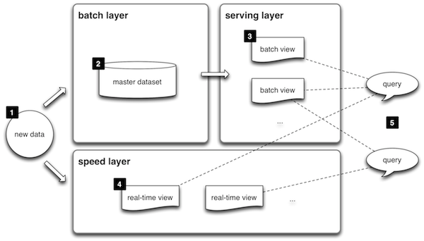



### What is the Lambda Architecture?

Based on his experience working on distributed data processing systems at
Backtype and Twitter, [Nathan Marz](https://twitter.com/nathanmarz) proposed
a generic architecture addressing common requirements, called the Lambda Architecture.
These requirements include the need for a robust system that is fault-tolerant,
both against hardware failures and human mistakes, being able to serve a wide 
range of workloads and use cases, in which low-latency reads and updates are 
required. The resulting system should be linearly scalable, and it should scale out 
rather than up. 

Here's how it looks like, from a high-level perspective:

1. All **data** entering the system is dispatched to both the batch layer and the speed layer for processing.
1. The **batch layer** has two functions: (i) managing the master dataset, an immutable, append-only set of raw data, and (ii) to pre-compute the batch views.
1. The **serving layer** indexes the batch views so that they can be queried in ad hoc with low latency. 
1. The **speed layer** compensates for the high latency of updates to the serving layer. This layer deals with recent data only.
1. Any incoming **query** can be answered by merging results from batch views and real-time views.

### Entries

<ul class="posts">
  
    <li>{{ post.date | date_to_string }} &raquo; <a href="{{ BASE_PATH }}{{ post.url }}">{{ post.title }}</a> by <a href="http://twitter.com/{{ post.author_twitter }}">{{ post.author }}</a></li>
  
</ul>
